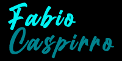
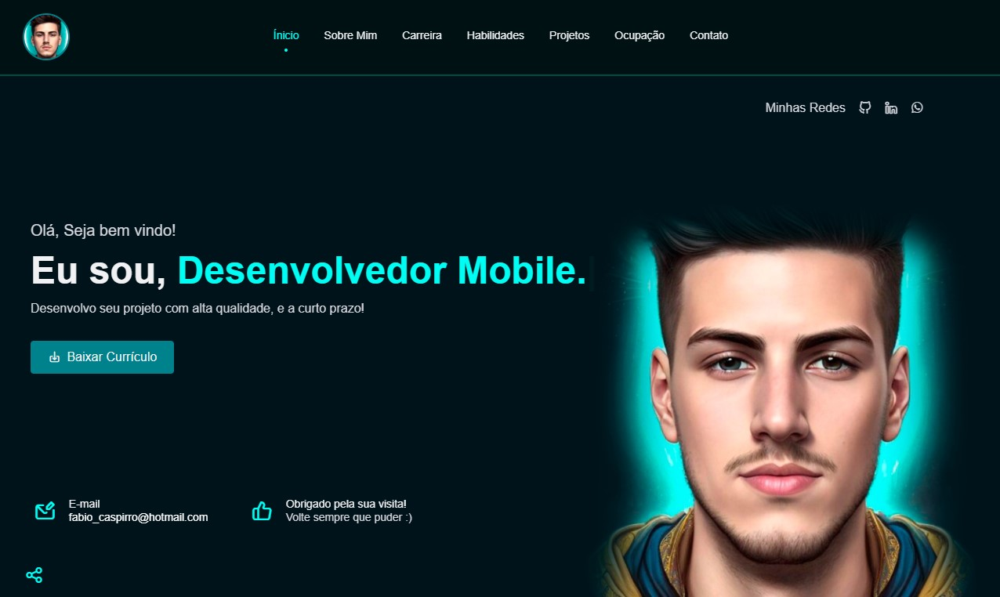
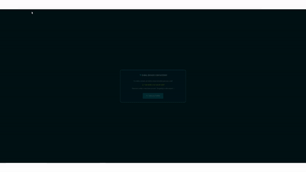

<h3 align="center">
	
</h3>

<p align="center">
 
 </p>

<h5 align="center"> 
  <b>🔄 Atualizado | <i>Updated 🔄</i></b>
</h5> 

<p align="center">
 
 
</p>

---
  
<h3 align="center"> 
  <b>🎞 Demonstração Grandes Dispositivos | <i>Demo Big Devices</i>
</h3>

<h3 align="center">
	
</h3><br>

<h3 align="center"> 
 <b>  Demonstração Dispositivos Médios | Demonstração Dispositivos Pequenos <br>
 <i>  Demo Medium Devices</i> |<i> Demo Small Devices </i>
</h3><br>

<div align="center">

  

  

</div><br>


<h3 align="center"> 
 <b>Demonstração Envio de Formulário | <i> Form Submission Demonstration </i>
 </h3>
<h3 align="center">
	
</h3><br>
  
---

<h2 align="left"> 
  <b>Índice</b> | <i>Index</i>
</h2> 
  
- :book: [Sobre | <i>About</i>](#book-sobre-o-projeto)
- :computer: [Tecnologias | <i>Tecnologies</i>](#computer-tecnologias-utilizadas)
- :mag_right: [Como usar | <i>How to use</i>](#mag_right-como-usar)
  
---

## :book: Sobre o Projeto
><i>About</i> 

<h3>
A proposta do projeto é entregar um pouco dos meus conhecimentos, projetos e habilidades relacionados a programação e desenvolvimento web/ mobile e design.
</h3>

<em>
  <h6>
    The purpose of the project is to demonstrate some of my knowledge, proects and skills related to programming and web / mobile development and design.
  </h6>
</em><br>

### 🖼 Um pouco sobre as seções do meu portfólio: <br>

- **Ínicio:** Breve apresentação e onde me encontrar;
- **Sobre Mim:** Apresentação mais detalhada sobre quem sou e alguns detalhes;
- **Carreira:** Um pouco sobre minha carreira acadêmica e profissional;
- **Habilidades:** Um pouco das minhas habilidades nas áreas de front-end, back-end e UX/UI Design;
- **Projetos Recentes:** Exibe através de cards modais alguns projetos ja realizados nas áreas de front-end, back-end e UX/UI Design;
- **Serviços:** Exibe através de cards modais detalhes sobre minha forma e estilo de trabalho;
- **Contatos:** Meus principais contatos, e um formulário funcional para contato direto com redirecionamento para tela de agradecimento.<br><br>

<i>🖼 About sections of my portfolio:</i><br>

><i>• **Home:** Brief presentation and where to find me;<i><br>
><i>• **About Me:** More detailed presentation about who I am and some details;<i><br>
><i>• **Career:** A little about my academic and professional career;<i><br>
><i>• **Skills:** A little bit of my skills in the areas of front-end, back-end and UX/UI Design;<i><br>
><i>• **Recent Projects:** Displays through modal cards some projects already carried out in the areas of front-end, back-end and UX/UI Design;<i><br>
><i>• **Services:** Displays details about my way of working and style through modal cards;<i><br>
><i>• **Contacts:** My main contacts, and a functional form for direct contact with redirection to the thank you screen.<i><br>

---

<br>

## :computer: Tecnologias Utilizadas
><i>Tecnologies</i> 
  
<h4>
O projeto foi desenvolvido utilizando as seguintes tecnologias:
</h4>

<em>
  <h6>
    The project was developed using these technologies: <br><br><br>
  </h6>
</em>
  
  
<p>
» HTML <br>
<p>
» CSS <br>
</p>
  
 » [Javascript](https://javascript.com)
  
</p><br>

### 🚀 API <br>

[Typed.JS](https://github.com/mattboldt/typed.js)

[MixItUp](https://mixitupapp.com/)

[Aos](https://michalsnik.github.io/aos/)

<br>

### ⚙ IDE <br>
  
<p>
  
 » [Visual Studio Code](https://code.visualstudio.com/)
  
<p> <br>

---

## :mag_right: Como Usar
><i>How to Use</i> 
  
Para copiar o projeto, utilize os comandos:
 <em>
  <h6>
  To copy the project, use the commands:
  </h6>
</em>

```bash
  # Clonar o repositório | Clone repositories
  » git clone https://github.com/fcaspirro/portfolio-fcaspirro.git

```

Link para página Web:
 <em>
  <h6>
  Link to website page:
  </h6>
</em>
  
```bash  
  # Link Github Pages
  » https://fcaspirro.github.io/portfolio-fcaspirro/
  
```
  
---

<div align="center">

## 👩🏻‍💻 Autor | <i>Author</i> <br>

  <table>
    <tr>
      <td align="center">
        <a href="https://github.com/fcaspirro">
          <br>
          <sub>
            <b>Fabio Caspirro</b>
          </sub>
        </a>
      </td>
    </tr>
  </table>
</div>
 
<h4 align="center">
Made by: Fabio Caspirro 😄 <a href="mailto:fabio_caspirro@hotmail.com">Entre em contato | <i>Contact</i></a>
</h4>
<p align="center">
  <a href="https://www.linkedin.com/in/fabio-caspirro/">
    
  </a>  
